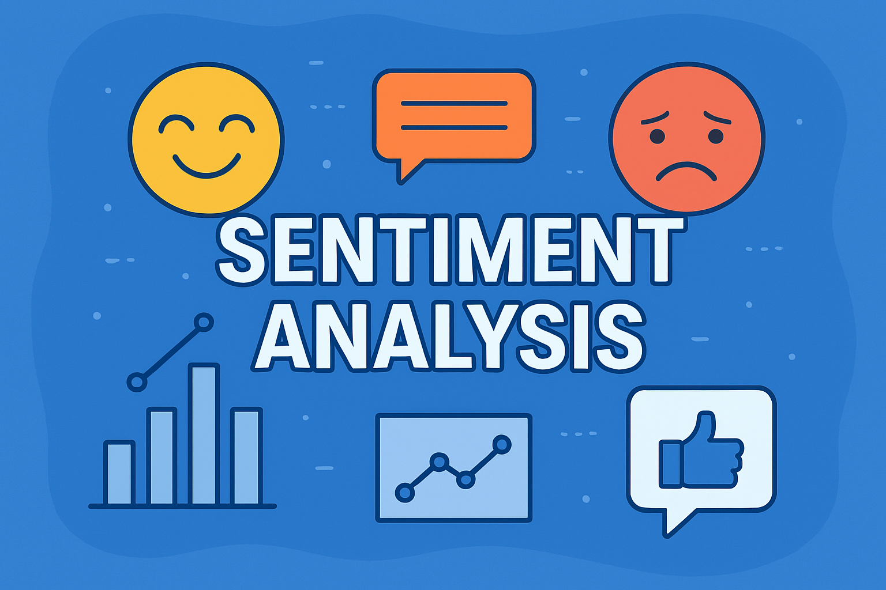

# Sentiment Analyzer 🎯

A simple NLP project that classifies text as **Positive, Neutral, or Negative** using Hugging Face Transformers + Gradio.  

## 🚀 Live Demo
👉 [Try it on Hugging Face](https://fatima1228-sentiment-analyzer.hf.space/)

## 📸 Screenshot


## ✨ Features
- Classifies text sentiment in real-time
- Uses Hugging Face Transformers
- Interactive Gradio Interface
- Easy to run locally

## 🛠 Tech Stack
- Python
- Hugging Face Transformers
- Gradio
- GitHub + Hugging Face Spaces

## 🔧 Run Locally
Clone the project:
```bash
git clone https://github.com/username/repo-name.git
cd repo-name
pip install -r requirements.txt
python app.py
